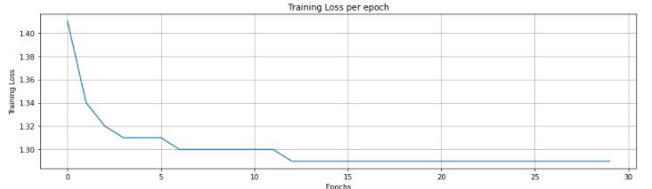
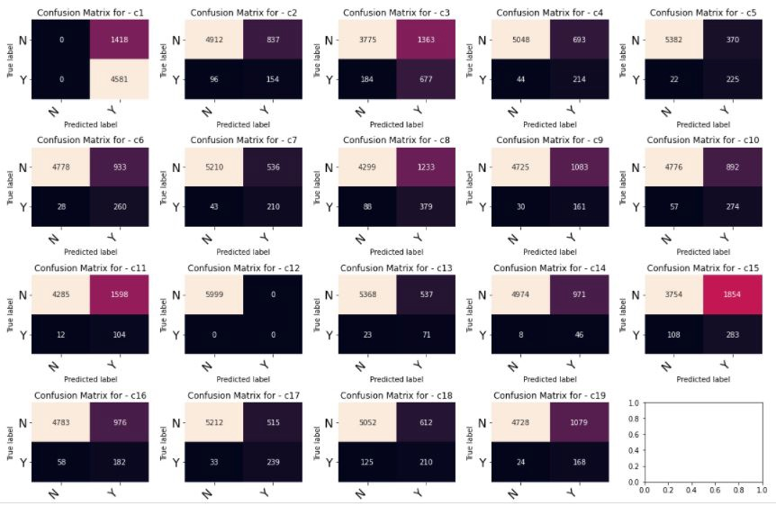

# Multilabel-Image-classication

### About Dataset
The data set consists of 40,000 colour images, split into training and testing sets of 30,000 and 10,000 images respectively. Each observation in the training set had one or more class labels, with 19 classes in total. The testing set had no labels and is evaluated on the basis of Kaggle competition submissions, from which the evaluation method is the F1 score.

### Pre-Processing
#### Class imbalance
The data set presented a potential issue of class imbalance. The distribution of classes amongst the training data set was extremely unbalanced, with class 1 containing a signicantly higher number of observations than any other class.

#### Augmentation
Data augmentation can signicantly aid in a reducing model's generalisability (test) error. By adding transformations to the original data set, we are effectively creating new data which can be used for parameter training. There are many ways to augment the data - a selection of these methods are outlined below and were used for the training process.

Data augmentation was performed using the PyTorch transforms module. Various forms of data augmentation were considered and implemented, including:
  * RandomHorizontalFlip (some images are horizontally fipped at random)
  * RandomRotation[-30,30] (some images are rotated at random)
  * ColorJitter (changes to the brightness, contrast, saturation and hue of an image are made at random)

### Models
1. Alexnet - built frm scratch using PyTorch
2. Resnet - Pre-trained resnet from PyTorch Library with different convolution layers ranging frm 18 to 50.

### Training Loss vs Epochs 

  
   
  <i>Training Loss vs Epochs</i>

### Confusion Matrix for Predicted Labels 

  
   
  <i>Confusion Matrix</i>

